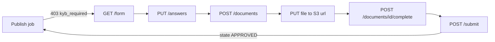

# Employer KYB — frontend integration

An employer cannot publish a job until its organisation has passed KYB. The
publish call returns `403 kyb_required` with `params.kyb_status` until
`employers.kyb_status` is `APPROVED` (invariant 8).

Approval is **off by default** (`config_values` key `kyb.require_approval`
absent), so a complete submission is approved the moment it is submitted.

Sources: `backend/app/modules/kyb/{router,schemas,forms,service,domain}.py`,
`backend/app/core/forms.py`, `backend/app/modules/employer/reference.py`.

## The flow



- All routes are under `/api/v1/employer/kyb`.
- **Owner only.** A recruiter or viewer gets `403`.
- Handle `kyb_required` on publish by sending the user into this flow.
  `kyb_status` tells you what to show: `DRAFT` = not started, `SUBMITTED` =
  waiting for review.
- After KYB, publishing also needs an active subscription (`402
  subscription_required`) — a separate check.

## 1. Read the form and current progress

### `GET /form`

No body. Returns the form definition. **Render from this rather than
hard-coding the fields below** — the form is a placeholder
(`FORM_VERSION = placeholder-1-2026-09-11`) and will change.

```json
{
  "code": "EMPLOYER_KYB",
  "version": "placeholder-1-2026-09-11",
  "sections": [ { "code": "organisation", "fields": [ ... ] }, ... ],
  "options": {
    "employer.EMPLOYER_TYPES": [ { "code": "STARTUP", "label": "Startup" }, ... ],
    "employer.INDUSTRIES": [ ... ],
    "kyb.EMPLOYEE_COUNT_BANDS": [ ... ],
    "reference.INDIAN_STATES": [ ... ]
  }
}
```

### `GET /`

No body. Returns the current submission (same shape as the `/submit`
response, §4) so the UI can resume a half-filled form.

## 2. Save answers — `PUT /answers`

A partial save. Fields sent replace what is stored; `null` clears a field.
**Required fields are only enforced at submit**, but malformed values are
rejected on every save.

```json
{
  "answers": {
    "legal_name": "Brightline Technologies Private Limited",
    "trade_name": "Brightline",
    "employer_type": "PRIVATE_LIMITED",
    "industry": "IT_SOFTWARE",
    "employee_count_band": "11_50",
    "website": "https://brightline.example",
    "about": "We build billing software for clinics.",

    "pan": "ABCDE1234F",
    "gstin": "29ABCDE1234F1Z5",
    "cin": "U72900KA2020PTC123456",
    "tan": "BLRB12345C",

    "address_line1": "12, 4th Cross, Indiranagar",
    "address_line2": null,
    "city": "Bengaluru",
    "state": "KA",
    "pincode": "560038",

    "signatory_name": "Anita Rao",
    "signatory_designation": "Director",
    "work_email": "anita@brightline.example",
    "work_phone": "+919876543210",

    "undertaking_genuine_hiring": true,
    "undertaking_no_redistribution": true,
    "undertaking_authorised": true
  }
}
```

Rules:

- Send option **codes**, not labels.
- An unknown key → `unknown_field`.
- Never send document fields (`doc_*`) here → `not_answerable`.
- Never send `state` / `status` — the request is refused (422).
- At most 100 keys per request.

### Fields

| Section | Field | Type | Required | Rule |
| --- | --- | --- | --- | --- |
| Organisation | `legal_name` | text | yes | max 255 |
| Organisation | `trade_name` | text | | max 255; the name candidates see |
| Organisation | `employer_type` | select | yes | see codes below |
| Organisation | `industry` | select | yes | see codes below |
| Organisation | `employee_count_band` | select | | see codes below |
| Organisation | `website` | text | | max 255 |
| Organisation | `about` | textarea | | max 1000 |
| Identifiers | `pan` | text | yes | `^[A-Z]{5}[0-9]{4}[A-Z]$` (uppercase) |
| Identifiers | `gstin` | text | | `^[0-9]{2}[A-Z]{5}[0-9]{4}[A-Z][0-9A-Z]Z[0-9A-Z]$` |
| Identifiers | `cin` | text | | `^[LUu][0-9]{5}[A-Za-z]{2}[0-9]{4}[A-Za-z]{3}[0-9]{6}$` |
| Identifiers | `tan` | text | | `^[A-Z]{4}[0-9]{5}[A-Z]$` |
| Address | `address_line1` | text | yes | max 255 |
| Address | `address_line2` | text | | max 255 |
| Address | `city` | text | yes | max 120 |
| Address | `state` | select | yes | two-letter state code (`KA`, `MH`, `DL`, …) |
| Address | `pincode` | text | yes | `^[1-9][0-9]{5}$` |
| Contact | `signatory_name` | text | yes | max 180 |
| Contact | `signatory_designation` | text | yes | max 120 |
| Contact | `work_email` | email | yes | max 255; free email providers allowed |
| Contact | `work_phone` | phone | yes | `^(\+91)?[6-9][0-9]{9}$` |
| Undertakings | `undertaking_genuine_hiring` | checkbox | yes | JSON `true` |
| Undertakings | `undertaking_no_redistribution` | checkbox | yes | JSON `true` |
| Undertakings | `undertaking_authorised` | checkbox | yes | JSON `true` |

Checkboxes must be a JSON boolean: `false` → `must_be_accepted`, `"true"` →
`wrong_type`.

### Option codes

- **`employer_type`**: `STARTUP`, `PRIVATE_LIMITED`, `PUBLIC_LIMITED`, `MNC`,
  `GOVERNMENT`, `NGO`, `STAFFING_AGENCY`, `EDUCATIONAL_INSTITUTION`,
  `PROPRIETORSHIP`
- **`industry`**: `IT_SOFTWARE`, `BPO_KPO`, `BANKING_FINANCE`, `HEALTHCARE`,
  `MANUFACTURING`, `CONSTRUCTION`, `RETAIL_ECOMMERCE`, `EDUCATION`,
  `LOGISTICS_TRANSPORT`, `HOSPITALITY_TOURISM`, `MEDIA_ENTERTAINMENT`,
  `TELECOM`, `AGRICULTURE`, `ENERGY_UTILITIES`, `AUTOMOTIVE`,
  `TEXTILES_APPAREL`, `PROFESSIONAL_SERVICES`, `GOVERNMENT_PUBLIC`, `OTHER`
- **`employee_count_band`**: `1_10`, `11_50`, `51_200`, `201_500`,
  `501_1000`, `1001_5000`, `5000_PLUS`
- **`state`**: take from `options["reference.INDIAN_STATES"]` in `GET /form`.

Response: the submission object (§4).

## 3. Upload documents

Three calls per document.

| `doc_type` | Document | Required |
| --- | --- | --- |
| `doc_pan` | PAN card | yes |
| `doc_registration` | Certificate of incorporation or registration | |
| `doc_gst` | GST registration certificate | |
| `doc_authorisation` | Letter authorising the signatory | |

### 3a. `POST /documents` — get an upload URL

```json
{ "doc_type": "doc_pan" }
```

Response `201`:

```json
{
  "upload_id": "0b6c1f0e-7a3d-4c52-9b8e-2f1d6a4e9c10",
  "doc_type": "doc_pan",
  "url": "https://…presigned S3 URL…",
  "method": "PUT",
  "expires_in_seconds": 900,
  "max_bytes": 10485760,
  "accepted_types": ["application/pdf", "image/jpeg", "image/png"]
}
```

`expires_in_seconds` comes from server config; read it, don't assume it.

### 3b. `PUT` the file to `url`

- Raw file bytes as the body — **not** multipart.
- **Do not** send our `Authorization` header to S3.
- Max 10 MB. PDF, JPEG or PNG. The type is sniffed from the file's bytes,
  not its extension.

### 3c. `POST /documents/{upload_id}/complete`

```json
{ "doc_type": "doc_pan" }
```

`doc_type` must match 3a. The server checks the stored object; if it is
refused (`kyb_document_rejected`, `params.reason` = `empty` | `too_large` |
`unsupported_type`) the object is deleted and the user must upload again.

Response: the submission object (§4), with the document in `documents`.

## 4. Submit — `POST /submit`

No body. Validates everything, then approves (or queues, if review is
switched on).

```json
{
  "submission_id": "5d1e2c7a-3f4b-4a8e-9c0d-1b2a3c4d5e6f",
  "state": "APPROVED",
  "form_version": "placeholder-1-2026-09-11",
  "answers": { "legal_name": "Brightline Technologies Private Limited", "...": "..." },
  "documents": [
    { "doc_type": "doc_pan", "mime": "application/pdf", "uploaded_at": "2026-09-17T10:15:00Z" }
  ],
  "submitted_at": "2026-09-17T10:20:00Z",
  "reviewed_at": "2026-09-17T10:20:00Z",
  "decision_reason": null,
  "auto_approved": true
}
```

`state` is one of `DRAFT`, `SUBMITTED`, `UNDER_REVIEW`, `APPROVED`,
`REJECTED`, `MORE_INFO_REQUIRED`. On `APPROVED`, retry the job publish.

## Errors

All errors are problem+json with a `code` and `params`. Render your own text
from `code`; never display `title`.

| Status | `code` | When | What to do |
| --- | --- | --- | --- |
| 403 | `kyb_required` | Publishing before approval | Send the user into KYB |
| 422 | `kyb_answers_invalid` | Save or submit with bad or missing answers | Mark every listed field — all issues come back at once |
| 422 | `kyb_unknown_document_type` | `doc_type` not one of the four | Fix the client |
| 422 | `kyb_document_rejected` | File empty, over 10 MB, or not PDF/JPEG/PNG | Ask for a different file |
| 404 | `kyb_upload_not_found` | `complete` before the PUT finished, or wrong `upload_id` / `doc_type` | Finish the PUT, then retry |
| 409 | `kyb_not_editable` | Editing after submission | Show the submitted state read-only |
| 409 | `kyb_already_verified` | Organisation already approved | Nothing to do; go to publish |
| 403 | — | Caller is not the organisation owner | Only the owner can complete KYB |

Per-field issue codes inside `kyb_answers_invalid`: `required`,
`invalid_format`, `not_an_option`, `too_long`, `wrong_type`,
`must_be_accepted`, `unknown_field`, `not_answerable`.

## Open points

- If `kyb.require_approval` is switched on, submissions stop at `SUBMITTED`
  and **nothing can approve them yet** — review actions have no route until a
  platform-staff account exists (`docs/blockers.md` E10).
